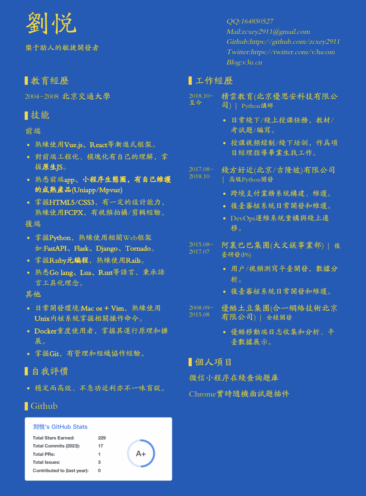

# colorful_resume_template

## How to use

```
/* 简历前景色和背景色 */
:root{
   --bg-color:#005BBB;
   --font-color:#FFD500;
}

/* 简历字体 */
@font-face {
font-family: mFont;
src: url('./fonts/北魏楷书字体.ttf');
}
        body{
            font-family:mFont;
            background-color: var(--bg-color);
            color: var(--font-color);
    }
```

## sample


